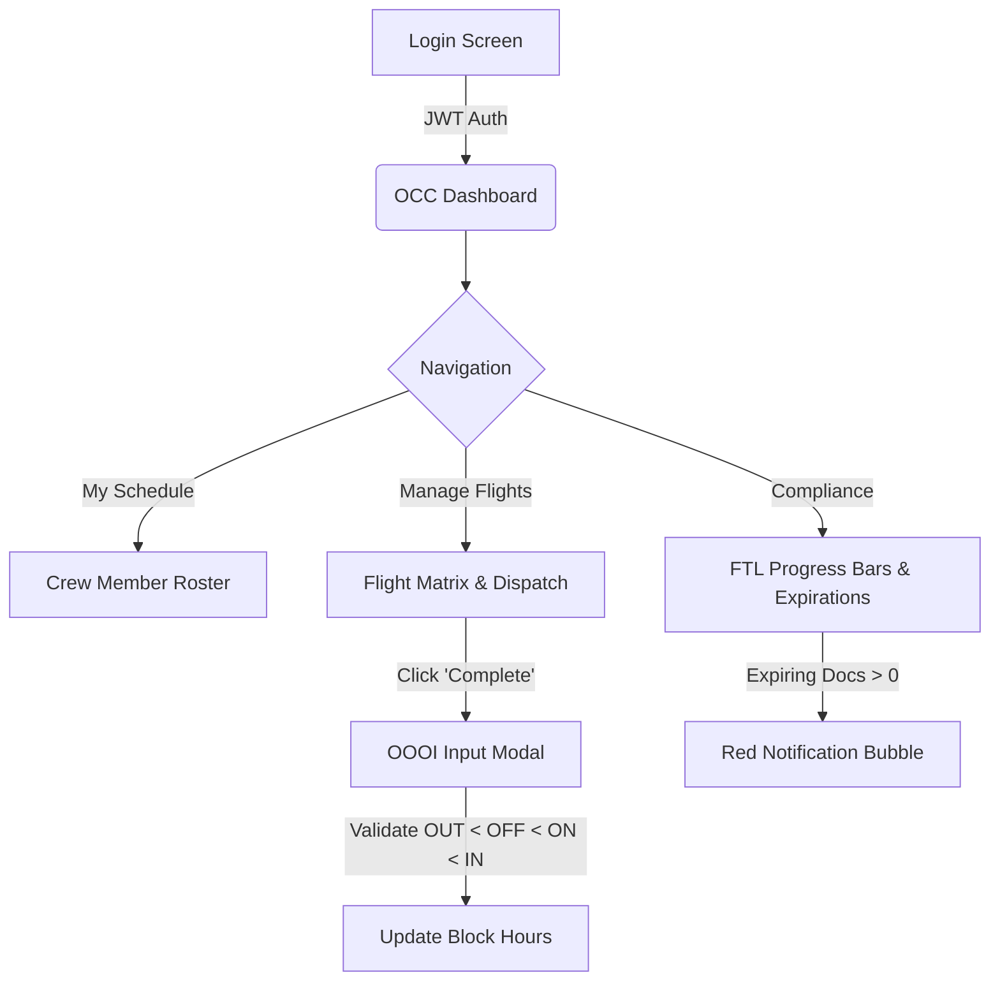

# FAMS 2.0 Product & Technical Specifications

This document consolidates the Product Requirement Document (PRD), Software Requirements Specification (SRS), Functional Specification Document (FSD), and UI/UX Design Specifications for FAMS 2.0, modeled after industry leaders like AIMS, Sabre, and Navblue.

---

## 1. Product Requirement Document (PRD)

### 1.1 Objective
To upgrade FAMS into a top-tier, white-labelable Airline Operations Control Center (OCC) and Crew Management platform capable of handling commercial airline scale, with integrated flight dispatch, FTL compliance, and maintenance tracking.

### 1.2 Target Audience
- **Operations Control Center (OCC) Dispatchers:** Real-time monitoring of fleet and schedules.
- **Crew Schedulers:** Managing rosters, legality (EASA FTL), and standby assignments.
- **Flight & Cabin Crew:** Accessing rosters, completing flights (OOOI), and updating documents.
- **Maintenance (MRO):** Tracking Aircraft on Ground (AOG) and Minimum Equipment List (MEL).

### 1.3 Key Features
1. **Dynamic Dashboard:** Real-time visibility into On-Time Performance (OTP) and active fleet.
2. **Advanced FTL Compliance:** EASA/FAA rolling limits.
3. **Automated Readiness Checker:** Mathematical validation of aircraft seating vs. assigned crew.
4. **Security Hardened Architecture:** Protection against XSS, CSRF, and Brute Force attacks.

---

## 2. Software Requirements Specification (SRS)

### 2.1 Technology Stack
- **Backend:** FastAPI (Python 3.13) with SQLAlchemy ORM.
- **Database:** SQLite (Phase 1), migrating to PostgreSQL (Phase 2).
- **Frontend:** Vanilla JS + CSS3 (Glassmorphism & CSS Variables) + HTML5.
- **Authentication:** OAuth2 JWT Bearer Tokens with Bcrypt hashing.

### 2.2 Security Requirements (Hardening)
To ensure the system cannot be hacked:
- **Rate Limiting:** Protect login endpoints to prevent credential stuffing.
- **Security Headers:** Strict-Transport-Security, X-Content-Type-Options, X-Frame-Options.
- **CORS Configuration:** Restrict cross-origin access.
- **Input Sanitization:** All inputs parameterized via SQLAlchemy to prevent SQLi.

---

## 3. Functional Specification Document (FSD)

### 3.1 Flight Management (OCC)
- System must allow scheduling flights with Origin, Destination, Aircraft, and Scheduled times.
- Must support OOOI block times (Out, Off, On, In) and IATA delay codes.

### 3.2 Compliance & Safety
- **FTL Rules:** 28-day (100h) and 365-day (900h) flight limits.
- **Readiness:** Flight cannot depart without 1 Captain, 1 FO, and 1 FA per 50 seats.

---

## 4. UI/UX Design Specification & Wireframes

### 4.1 Design System
- **Theme:** Professional Dark Mode (`#0f172a` base) with Glassmorphism modals (`backdrop-filter: blur`).
- **Typography:** 'Inter' for highly legible data tables.
- **Status Colors:** 
  - `Green (#10b981)`: Ready / Compliant
  - `Red (#ef4444)`: Expired / AOG / Delayed
  - `Yellow (#eab308)`: Expiring / MEL / Standby

### 4.2 Interactive Prototype / Wireframe Flow

### 4.3 User Flow: OCC Dispatcher resolving an AOG
1. Dispatcher sees Aircraft marked as `AOG` (Red Badge).
2. Flight assigned to Aircraft is flagged as `Warning`.
3. Dispatcher edits Flight -> Assigns new Active Aircraft.
4. Readiness Checker automatically recalculates required Cabin Crew based on new seat count.
